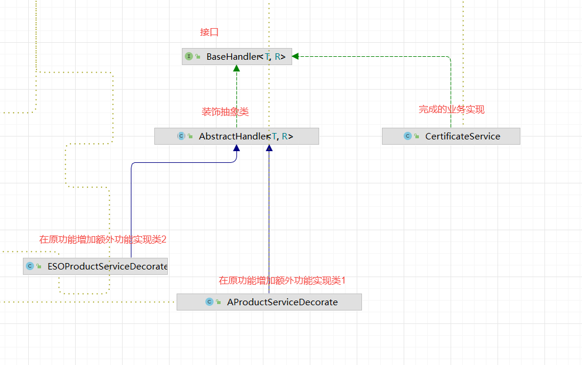

# 装饰器模式

## 4个角色

- 接口类
- 原功能实现类
- 装饰类： 实现接口
- 装饰实现类：添加一些额外功能，继承装饰类

类图如下

特点：
1. 装饰器模式可以在不修改原有接口的基础上额外添加其他业务逻辑
2. 装饰器模式可动态的添加，动态的移除某些业务操作（动态可插拔）
3. 其实现方式不同于继承且优于继承
    a. 继承方式：继承实现需要重写类中的方法，
     - 业务耦合性更大
     - 有些类不适合再次被继承（比如最终类Object）
     - java中一个类只能有一个父类，如果改类已经存在父类那么就不合适了
   b. 装饰器模式：业务操作更解耦可动态的添加/移除业务逻辑
     - 代码解耦
     - 

应用场景：
- 游戏皮肤切换，在原有基础上额外配置不同的皮肤展示